# Hospital Management System - UML Class Diagram

```mermaid
classDiagram
    class Person {
        <<Abstract>>
        #String identification
        #String firstName
        #String lastName
        #LocalDate birthDate
        #String phone
        #String email
        #String address
        #Gender gender
        #String bloodType
        +String getFullName()
        +String getRole()
    }

    class Patient {
        -String emergencyContact
        -String medicalHistory
        -String allergies
        -String currentMedication
        -List~Appointment~ appointments
        -List~MedicalRecord~ medicalRecords
    }

    class Doctor {
        -String licenseNumber
        -List~Specialty~ specialties
        -List~Appointment~ appointments
    }

    class Nurse {
        -String licenseNumber
        -List~Specialty~ specializations
    }

    class Appointment {
        -LocalDateTime dateTime
        -String reason
        -String status
        -String notes
    }

    class MedicalRecord {
        -LocalDate date
        -String diagnosis
        -String treatment
        -String notes
    }

    class Medicine {
        -String name
        -String description
        -String dosage
        -String manufacturer
        -double price
    }

    class Treatment {
        -LocalDate startDate
        -LocalDate endDate
        -String instructions
        -String status
    }

    class Room {
        -String number
        -String type
        -int capacity
        -boolean isOccupied
    }

    class Specialty {
        -String name
        -String description
    }

    class Invoice {
        -LocalDate date
        -double amount
        -String status
        -String paymentMethod
    }

    Person <|-- Patient
    Person <|-- Doctor
    Person <|-- Nurse
    
    Patient "1" -- "*" Appointment : has
    Doctor "1" -- "*" Appointment : handles
    Patient "1" -- "*" MedicalRecord : has
    Patient "1" -- "*" Invoice : generates
    Doctor "1" -- "*" MedicalRecord : creates
    MedicalRecord "1" -- "*" Medicine : contains
    Treatment "1" -- "1" MedicalRecord : documents
    Doctor "1" -- "*" Treatment : prescribes
    Patient "1" -- "0..1" Room : assigned to
    Doctor "1" -- "*" Specialty : has
    Nurse "1" -- "*" Specialty : has
```

## Key Relationships

1. **Inheritance**:
   - `Person` is the abstract base class for `Patient`, `Doctor`, and `Nurse`

2. **Associations**:
   - A `Patient` can have multiple `Appointment`s and `MedicalRecord`s
   - A `Doctor` handles multiple `Appointment`s and creates `MedicalRecord`s
   - A `MedicalRecord` can contain multiple `Medicine`s
   - A `Treatment` is associated with one `MedicalRecord`
   - `Doctor`s and `Nurse`s can have multiple `Specialty`s
   - A `Patient` can be assigned to one `Room`

3. **Composition/Aggregation**:
   - `MedicalRecord` is composed of multiple `Medicine` objects
   - `Treatment` is part of a `MedicalRecord`

## Notes
- The diagram uses standard UML notation with:
  - `+` for public members
  - `-` for private members
  - `#` for protected members
  - `<<Abstract>>` for abstract classes
  - Multiplicity indicators (e.g., `1`, `*`, `0..1`)
